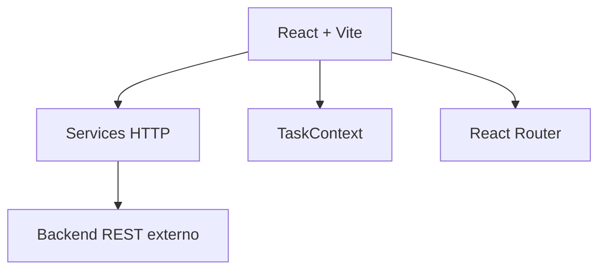

# Gerenciador de Tarefas

Aplicação web para gerenciamento de tarefas com autenticação, filtros, busca, favoritos e edição de itens. Este repositório contém o frontend da aplicação, desenvolvido em React, consumindo um backend REST externo configurado por variável de ambiente.

## Tecnologias

- React 19
- React DOM
- React Router 7
- Vite 6
- JavaScript
- Tailwind CSS 4
- @tailwindcss/vite
- React Icons
- JSON Server (dependência legada/local)
- ESLint
- Vercel
- HTML5
- CSS3

## Funcionalidades

- Cadastro de usuários.
- Login de usuários.
- Autenticação por token armazenado no `localStorage`.
- Proteção da rota principal para usuários autenticados.
- Logout.
- Listagem de tarefas.
- Criação de tarefas.
- Edição do nome de tarefas.
- Exclusão de tarefas.
- Marcação de tarefas como concluídas.
- Marcação de tarefas como favoritas/importantes.
- Filtro por todas as tarefas ou tarefas favoritas.
- Busca de tarefas por nome.
- Separação visual entre tarefas pendentes e tarefas concluídas.
- Menu lateral esquerdo para filtros, busca e logout.
- Menu lateral direito para visualizar, editar e apagar tarefas.
- Feedback visual com loading global.
- Feedback de sucesso e erro com toast.

## Arquitetura

Este é um projeto Frontend. A aplicação React é responsável pela interface, roteamento, estado global e comunicação HTTP com uma API REST externa definida por `VITE_BASE_URL`.

O estado compartilhado da aplicação fica centralizado em `TaskContext`, enquanto regras de interação e chamadas HTTP são organizadas em hooks e services.



O arquivo `db.json` permanece no repositório como um artefato de versões iniciais do projeto, quando a aplicação ainda utilizava uma base local simulada. O fluxo atual do frontend está direcionado para uma API real por meio dos services em `src/services`.

## Instalação

Clone o repositório:

```bash
git clone https://github.com/FabioCoutinho1/Geranciador-de-tarefas.git
```

Acesse a pasta do projeto:

```bash
cd Geranciador-de-tarefas
```

Instale as dependências:

```bash
npm install
```

## Variáveis de ambiente

O projeto utiliza a seguinte variável de ambiente:

```env
VITE_BASE_URL=http://localhost:3001
```

Crie ou ajuste o arquivo `.env` na raiz do projeto conforme a URL da API REST utilizada.

## Executando o projeto

Inicie a aplicação em modo de desenvolvimento:

```bash
npm run dev
```

Gere a build de produção:

```bash
npm run build
```

Visualize a build localmente:

```bash
npm run preview
```

Execute o lint:

```bash
npm run lint
```

Para executar o fluxo completo, mantenha o backend da aplicação rodando e configure `VITE_BASE_URL` com a URL correta da API.

## Endpoints da API

A aplicação consome uma API REST externa configurada por `VITE_BASE_URL`. Os endpoints abaixo foram identificados a partir dos services do frontend.

### Autenticação

- `POST /user/login` -> Realizar login e retornar token de autenticação.
- `POST /user/register` -> Cadastrar usuário e retornar token de autenticação.

### Usuários

- `GET /user/infouser` -> Buscar informações do usuário autenticado.

### Tarefas

- `GET /task` -> Listar tarefas.
- `POST /task` -> Criar tarefa.
- `PUT /task/{id}` -> Atualizar um campo da tarefa.
- `DELETE /task/{id}` -> Remover tarefa.

## Estrutura do Projeto

```text
.
├── src
│   ├── assets
│   ├── components
│   │   ├── auth
│   │   ├── layouts
│   │   │   ├── containerTask
│   │   │   ├── leftAsideMenu
│   │   │   └── rightAsideMenu
│   │   └── ui
│   ├── context
│   ├── hooks
│   ├── pages
│   ├── services
│   ├── utils
│   ├── App.jsx
│   ├── main.jsx
│   └── router.jsx
├── db.json
├── eslint.config.js
├── index.html
├── package.json
├── vite.config.js
└── vercel.json
```

## Testes

Não foi identificado script de testes automatizados no `package.json`.

Para validar a qualidade estática do código, execute:

```bash
npm run lint
```

## Documentação da API

Não foi identificada configuração de Swagger/OpenAPI neste repositório.

## Screenshots

### Dashboard


### Visualização mobile


### Visualização em notebook


## Deploy

O projeto possui configuração para deploy na Vercel por meio do arquivo `vercel.json`.

A configuração redireciona todas as rotas para `index.html`, permitindo que o roteamento do React Router funcione corretamente em ambiente de produção:

```json
{
  "rewrites": [
    { "source": "/(.*)", "destination": "/index.html" }
  ]
}
```

Antes do deploy, configure a variável de ambiente `VITE_BASE_URL` na plataforma apontando para a API utilizada.

## Melhorias Futuras

- Remover arquivos legados utilizados nas primeiras versões do projeto.
- Padronizar os nomes dos campos entre frontend e backend.
- Adicionar testes automatizados para os principais fluxos.
- Melhorar o tratamento de autenticação e expiração de sessão.
- Evoluir a base para TypeScript em uma futura versão.

## Autor

Fabio Farias Coutinho

- GitHub: [FabioCoutinho1](https://github.com/FabioCoutinho1)

## Licença

Este projeto está licenciado sob a licença MIT.
